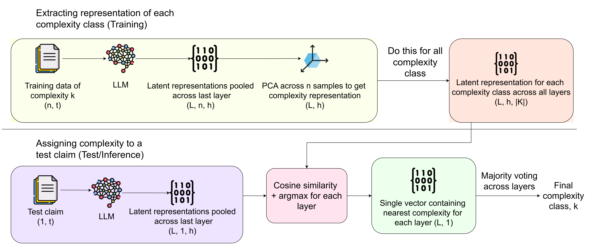

# Latent Representation Based Complexity Classifier for Claims

Determine the complexity of numerical claims using latent representation analysis and principal component based distance computations.

## Overview

This repository implements a complexity classifier for numerical claims that leverages latent representations to categorize claims into different complexity classes. The system extracts semantic embeddings from claims and assigns complexity levels by computing the nearest distance to first principal component representations of various complexity classes.


*Figure 1: CTRLA-inspired Classification Workflow*

### Key Features

- **Latent Representation Extraction**: Deep semantic embedding of numerical claims
- **PCA-based Classification**: First principal component analysis for complexity grouping
- **Distance Metric Classification**: Nearest neighbor approach using component distances
- **CTRLA-inspired Architecture**: Based on cutting-edge controllable text generation research
- **Flexible Configuration**: Easy parameter tuning through configuration files
- **Batch Processing**: Efficient handling of large claim datasets

## Research Context

This implementation is part of Master's thesis research investigating reasoning capabilities of LLMs for fact-checking applications. The approach is inspired by the `CtrlA: Adaptive Retrieval-Augmented Generation via Inherent Control` methodology.

### Methodology

The classifier operates through the following pipeline:

1. **Embedding Extraction**: Claims are processed to generate high-dimensional latent representations
2. **Principal Component Analysis**: Complexity classes are characterized by their first principal components
3. **Distance Computation**: New claims are classified based on nearest distance to complexity class' first principle components
4. **Classification Assignment**: Claims are put into appropriate complexity categories

## Quick Start

### Prerequisites

- Python 3.9+
- CUDA-compatible GPU (recommended for faster processing)
- Sufficient RAM for model loading and batch processing

### Installation

1. **Clone the repository**
   ```bash
   git clone https://github.com/primakovch/latent_rep_complexity_classification.git
   cd latent_rep_complexity_classification
   ```

2. **Set up virtual environment**
   ```bash
   python -m venv venv
   ```

3. **Activate the environment**
   
   **Windows:**
   ```bash
   venv\Scripts\activate
   ```
   
   **Linux/macOS:**
   ```bash
   source venv/bin/activate
   ```

4. **Install dependencies**
   ```bash
   pip install -r requirements.txt
   ```

## Data Preparation

### Dataset Format

Place your training and test data in the `data/` folder. Data should be in JSON format as a list of dictionaries with the following structure:

```json
[
  {
    "claim": "The population of Tokyo increased by 15% between 2010 and 2020",
    "label": "True",
    "complexity": 2
  },
  {
    "claim": "Apple's revenue exceeded $350 billion in fiscal year 2021",
    "label": "False", 
    "complexity": 1
  }
]
```

### Required Fields

- **`claim`**: The numerical claim text to be classified
- **`label`**: Ground truth veracity label (True/False/Conflicting)
- **`complexity`**: Complexity class integer (0 for simple, higher numbers for more complex)

## Configuration

Configure your classification parameters in `code/config.toml`:

```toml
# Example configuration
[model]
name = "model name as given in hugging-face model card"

[training]
data_path = "data/train.json"
sample_size = 100
batch_size = 8
seed = 0

[testing]
data_path = "data/test.json"
batch_size = 8
claim_key = "claims"
output_path = "output file where complexity class will be saved"

```


## Usage

### Running Classification

Execute the complexity classification pipeline:

```bash
python code/driver.py
```
The complexity result will be saved to `output/` directory.


## Methodology Background

This approach is inspired by the CTRLA paper's methodology for controllable text generation through latent space manipulation. The key insight is that complexity can be captured in the geometric structure of embedding spaces, where abstract concept like *complexity* point to a direction in the latent representation.

**Reference**: [CTRLA: Controllable Text Generation with Language Models](https://arxiv.org/abs/2405.18727)


## Contributing

This repository is a part of the thesis research. For questions, suggestions, or collaboration opportunities, please contact the author.

## Citation

If you use this work in your research, please cite:

```bibtex
@mastersthesis{Chungkham2025,
  author       = {Primakov Chungkham},
  title        = {Improving reasoning of Large Language Models for fact checking real-world complex claims},
  school       = {Delft University of Technology},
  year         = {2025},
  month        = {May},
  note         = {Master's thesis, Electrical Engineering, Mathematics and Computer Science},
  url          = {https://resolver.tudelft.nl/uuid:ff44df03-8f7f-4b96-996a-610b9189b5e3}
}
```

## Resources

- **📧 Contact**: [primakovc@gmail.com](mailto:primakovc@gmail.com)
- **📄 Thesis**: [Improving reasoning of Large Language Models for fact checking real-world complex claims](https://repository.tudelft.nl/record/uuid:ff44df03-8f7f-4b96-996a-610b9189b5e3)
- **📊 CTRLA Paper**: [CtrlA: Adaptive Retrieval-Augmented Generation via Inherent Control](https://arxiv.org/abs/2405.18727)

## License

Licensed under the Apache License 2.0. See the [LICENSE](LICENSE) file for details.

---

*This complexity classifier was developed as part of thesis research at TU Delft on improving automated fact-checking systems through advanced claim complexity assessment.*